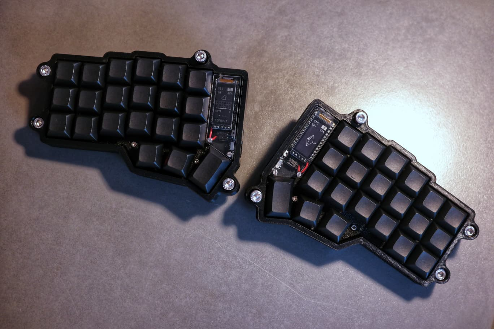
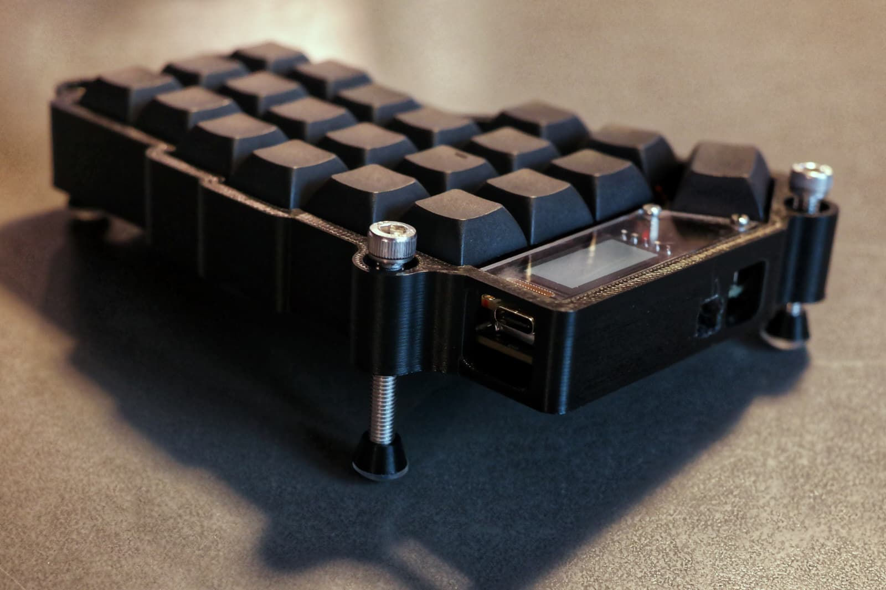

[](https://git.io/typing-svg)

<div align="center">
<p>
<a href="https://github.com/Pazl27/zmk-config-corne/stargazers"></a>&nbsp;&nbsp;
<a href="https://github.com/Pazl27/zmk-config-corne/forks"></a>&nbsp;&nbsp;
<a href="https://github.com/Pazl27/zmk-config-corne/commits/master/"></a>&nbsp;&nbsp;
<a href="https://github.com/Pazl27/zmk-config-corne/blob/master/LICENSE"></a>&nbsp;&nbsp;
</p>
</div>

# ZMK Configuration for Corne Keyboard (German Layout)

A custom ZMK firmware configuration for the Corne (CRKBD) split mechanical keyboard with German key layout and localization.




## Hardware Components

- **PCB**: Corne Cherry v3 from [Typeractive](https://typeractive.xyz/)
- **Case**: Custom case sourced from [Etsy](https://www.etsy.com/de/listing/1772253702/corne-mx-koffer)
- **Switches**: Gateron Phantom Brown tactile switches
- **Controller**: Nice!Nano v2 (wireless)
- **Display**: Nice!View displays
- **Layout**: German (DE) QWERTZ

## Display Configuration

The keyboards feature custom OLED display art sourced from [mctechnology17's zmk-nice-oled repository](https://github.com/mctechnology17/zmk-nice-oled). The displays show:
- Current layer status
- Bluetooth connection status
- words per minute count
- Battery level
- Custom graphics and animations

## Layout Overview

The configuration includes 4 main layers optimized for German typing and programming:

### Layer 0: Base Typing Layer (QWERTZ)
- Standard German QWERTZ layout
- German umlauts (ä, ö, ü) and ß in their traditional positions
- Optimized for daily typing in German

### Layer 1: Numbers & Programming Symbols  
- Numbers 0-9 on the home row
- Programming symbols and operators
- Brackets, parentheses, and special characters
- Mathematical operators

### Layer 2: German Special Characters & Navigation
- German-specific characters (°, Ä, €, Ü, etc.)
- Arrow keys for navigation
- Additional punctuation and accented characters
- System controls and media keys

### Layer 3: Bluetooth 
- Bluetooth pairing and connection management
- Profile switching (supports up to 5 devices)
- Reset and bootloader access

## 🇩🇪 German Localization

The German key definitions are generated using the [ZMK Locale Generator](https://github.com/joelspadin/zmk-locale-generator) and can be found in [`config/keys_de.h`](config/keys_de.h).

This ensures proper German character input including:
- Umlauts: ä, ö, ü, Ä, Ö, Ü
- Sharp S: ß, ẞ
- Special characters: €, °, §, µ, ², ³
- Proper dead key behavior for accents

## Building and Flashing

### Prerequisites
- [ZMK development environment](https://zmk.dev/docs/development/setup)
- GitHub account (for GitHub Actions build)

### Using GitHub Actions (Recommended)
1. Fork this repository
2. Enable GitHub Actions in your fork
3. Push changes to trigger automatic builds
4. Download the firmware files from the Actions artifacts
5. Flash the `.uf2` files to your Nice!Nano v2 controllers

### Flashing
1. Put the Nice!Nano into bootloader mode (double-tap reset)
2. Copy the generated `.uf2` file to the mounted drive
3. Repeat for the second half

## Repository Structure

```
├── .github/
│   └── workflows/
│       └── build.yml           # GitHub Actions build configuration
├── boards/
│   └── shields/
│       └── .gitkeep           # Placeholder for custom shields
├── config/
│   ├── corne.keymap          # Main keymap configuration
│   ├── keys_de.h            # German key definitions
│   ├── corne.conf           # Board configuration
│   └── west.yml             # West configuration
├── zephyr/
│   └── module.yml           # Zephyr module configuration
├── build.yaml               # Build targets configuration
└── README.md               # This file
```

## Key Features

- **Wireless Operation**: Powered by Nice!Nano v2 with ZMK firmware
- **German Layout**: Full German QWERTZ support with proper localization
- **Multi-Device**: Bluetooth connectivity with profile switching
- **Visual Feedback**: Nice!View displays with custom graphics
- **Low Power**: Optimized for battery life with sleep modes
- **Customizable**: Easy to modify layouts and add features

## Acknowledgments

- **Hardware**: [Typeractive](https://typeractive.xyz/) for the excellent Corne PCB
- **Display Art**: [mctechnology17](https://github.com/mctechnology17/zmk-nice-oled) for the beautiful OLED graphics
- **Localization**: [joelspadin](https://github.com/joelspadin/zmk-locale-generator) for the ZMK locale generator
- **Firmware**: [ZMK Firmware](https://zmk.dev/) team for the amazing wireless keyboard firmware
- **Community**: The mechanical keyboard and ZMK communities for inspiration and support

## License

This configuration is released under the MIT License. See the ZMK documentation for firmware licensing information.

---

*Happy typing! 🇩🇪⌨️*
